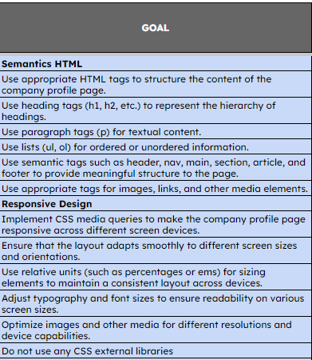

# MY WEBSITE : [varoseptra.my.id](https://varoseptra.my.id/)

# Readme

Deployment Step of this project using niagahoster(Domain) and netlify (hosting)

## How to deploy

### 1. Niagahoster

buy a domain in <a href="https://www.niagahoster.co.id/">Niagahoster</a>

- **Log in/sign up**: Log in or Sign up in niagahoster

- **Login using Google Account**: You can use google account to make it easier to directly creating your niagahoster account. The next step is do the verification for your google account on niagahoster. Niagahoster will send you the verification on your email. you can just click the email. 
- **Buy domain**: Go to [NIAGAHOSTER DOMAIN MENU](https://hpanel.hostinger.com/domains) Click on **Get a new domain** 

  - **Enter desire domain**: 
  - **Choose your domain and payment**: _EXAMPLE ==>_ Next click **Buy domain** and follow the instruction for the payment process.

- **after payment**: after the payment it will take about 2 hours to activate your domain. If the domain active you can check on the [NIAGAHOSTER DOMAIN MENU](https://hpanel.hostinger.com/domains) the status will be active like this ==>
  

## 2. Netlify

- **Sign Up / Login**: Go to [Netlify](https://app.netlify.com/) website, then signup / login  in this case i log in using github and do the step of the verification on my github to connect my github to the netlify

- **Hosting site using netlify**: After you have logged into your account, go to the site menu  click on the **Add new site** to create your new site and then i click **Deploy Manually**

  - **drag and drop folder** : it will go to this section where simply i can drag and drop my folder project or import it from my local computer 
  - **uploading process** : wait for the uploading proceess and dont refresh the site 

  - **uploading process** : Site is deploy/online 
    you can click **Open production deploy** to see your website online but your site have the template random name from netlify so the next step is apply our domain name that we already create using NIAGAHOSTER to our site.

- **Apply domain to our site** : go to the **Domain management menu**  click on **Add a domain**

- **Add Custom Domain** : add your custom domain for example my domain is [varoseptra.my.id](https://varoseptra.my.id/) and the click **verify** 

- **success add domain** : if success add domain it will show like this. After that click Add domain 

- **DNS configuration** : Go to the niagahoster and set the domain name server like your domain server on the netlify  
  - **On niagahoster** : Domain => Manage => Nameservers (**Change**) 
  - **Change Name server**:  Change the name servers from `Name Server 1` to `Name Server 4` 

- **Awaiting External DNS** : It will take about 24 hours (usually 2 hours) to propagate the dns    
- **Site online with active domain** :  can access site using my domain [varoseptra.my.id](https://varoseptra.my.id/)

## About The website

a view Goal for the website development course, which includes creating an responsive Company profile using HTML and CSS and this is the requirement fiture that should be included inside of the website :

### 1. **HEADER**
Header contain navigation bar included our service booking and contact us and also there is e hover for every menu bar.
 

### 2. **MAIN**
- **SECTION 1** :
contain of the logo and cover header picture.

- **SECTION 2** :
contain about trapokez services,information about opening hour, and the location of the trapokez barber

- **SECTION 3** :contain section about hair artist profile and price and also can book the hair artist it will link to the wa and send a message to admin

- **SECTION 4** :
about social media 

### 3. **FOOTER**
copyright info

